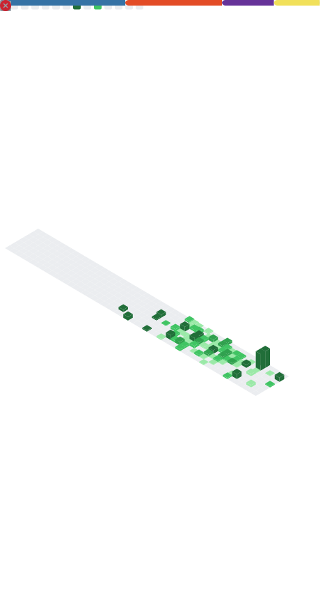

<h1 align="center">🚀 Widson Rodrigues • <em>@widson.dev</em></h1>

  

  
  
  
  

## Resumo Profissional

- **Trainee de Sistemas** @ LUFT — Foco em **Backend (Python/Flask/FastAPI)**, **APIs REST**, **Integração de Dados (ETL)**, **Automação** e **CI/CD**.
- 🎓 Estudante de **Ciência da Computação** na UNIP, com forte interesse em inovação, Inteligência Artificial (LLMs) e desenvolvimento de soluções inteligentes.
- Construção de **ferramentas internas**: desde módulos de controle financeiro (Real x Orçado), extração de dados (PDF/Excel) até dashboards interativos.
- Integrações robustas com **SQL (PostgreSQL, SQL Server, DuckDB)** e stack de dados em Python.
- **Deployment** focado em confiabilidade usando **Docker**, **Linux (Gunicorn + systemd)** e **GitHub Actions**.
- **Cultura de Observabilidade**: logs estruturados, métricas, healthchecks e documentação enxuta para troubleshooting rápido.

> **Objetivo:** Entregar valor real em produção com código limpo, escalável e mensurável.

## Minhas Ferramentas

  
  
  
  
  
  
  
  
  
  

## Minhas Especialidades
- **Backend & APIs** — Construção de APIs com Flask e FastAPI, autenticação, middlewares, paginação, tratamento de erros e gestão de arquivos.
- **Engenharia de Dados & ETL** — Ingestão de dados (PDF/Excel/SQL), limpeza de dados, normalização com Pandas/DuckDB e geração de relatórios automatizados.
- **Automação & Infra** — Jobs em lote (batch jobs), agendadores, monitoramento de arquivos e integrações de sistemas.
- **Observabilidade** — Logs estruturados, monitoramento de saúde das aplicações (healthchecks), alertas e post-mortems objetivos.
- **Segurança Básica** — Gestão de variáveis de ambiente (.env), princípio do menor privilégio e hardening básico de servidores.

## Estatísticas do GitHub

  
  

  

  

  

## Visão Geral de Métricas

  

## Projetos em Destaque

| Projeto | Preview | Stack Principal |
||||
| **Flask CRM** |  | Flask • Plotly • PostgreSQL • Pandas |
| **LuftDocs** |  | Flask • Bootstrap • Markdown • IA |

## Minhas Contribuições

  

## Contato
- ✉️ Email: **widsonrodrigues3@gmail.com**
- 💼 LinkedIn: **Widson Rodrigues**
