<!-- PROFILE: Widson64x/Widson64x -->
<h1 align="center">🚀 Widson Rodrigues • <em>Widson64x</em></h1>

  

  
  
  
  

---

## ⚡ Professional Summary

- **Systems Trainee (Engineering track)** @ LUFT — foco em **backend (Python/Flask)**, **REST APIs**, **ETL/Data Ops**, **automation** e **CI/CD**.
- Construção de **internal tools**: upload/extraction (PDF/Excel), **dashboards** e serviços de comparação/regra de negócio.
- Integrações com **SQL (PostgreSQL/SQLite)** e **Python data stack** (Pandas/Matplotlib).
- **Deployment** em Linux com **Gunicorn + systemd**, **Docker** e **GitHub Actions** — confiabilidade e simplicidade.
- **Observability-first**: logging estruturado, métricas/healthchecks, troubleshooting objetivo e docs enxutas.

> Objetivo: **ship rápido, com qualidade e mensurável** — valor real em produção.

---

## 🧰 Tech Stack (com logos)

  
  
  
  
  
  
  
  
  
  
  
  

---

## 🧠 Core Capabilities
- **Backend & APIs** — Flask blueprints, auth, middlewares, pagination, error handling, caching, file upload, export.
- **ETL & Data Pipelines** — ingest (PDF/Excel/SQL), **data cleaning**, normalização, KPIs e relatórios automatizados.
- **Automation** — batch jobs, schedulers, file watchers, integrações internas/externas.
- **DevOps / CI‑CD** — GitHub Actions, testes/linters, **Gunicorn + systemd**, containerization (Docker).
- **Observability** — logs estruturados, métricas/health, alerts; post‑mortems curtos e acionáveis.
- **Security basics** — .env/secret management, least‑privilege, backup/retention e hardening básico.

---

## 📊 Stats & Graphs (auto)

  
  

  

  

  

---

## 🧩 Metrics Poster
> Gerado por workflow e comitado como `metrics.svg`. (Instruções no repositório)

  

---

## 🗂️ Selected Work (visual)
> Adicione prints/GIFs na pasta `assets/` deste repo e referencie abaixo.

| Project | Preview | Stack |
|---|---|---|
| Internal Tools (Flask) | *(adicione `./assets/internal-tools.png`)* | Flask • Pandas • PostgreSQL • Actions |
| PDF → Excel & KPIs | *(adicione `./assets/pdf-excel-kpis.gif`)* | Pandas • Matplotlib • OpenPyXL |
| Comparativos / Rules Engine | *(adicione `./assets/rules-engine.png`)* | Python • ETL • Business Rules |

---

## 🐍 Contributions Snake
> O SVG é gerado pelo workflow `snake.yml` e publicado na branch `output`.

  

---

## 📫 Contact
- ✉️ Email: **widsonrodrigues3@gmail.com**
- 💼 LinkedIn: **Widson Rodrigues**

Feito com <b>Python</b> 🐍, <b>Flask</b> ⚗️ e disciplina de engenharia — simples, legível e pronto pra produção.

